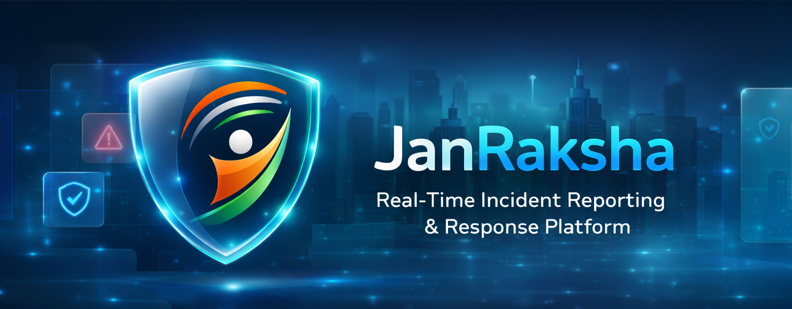
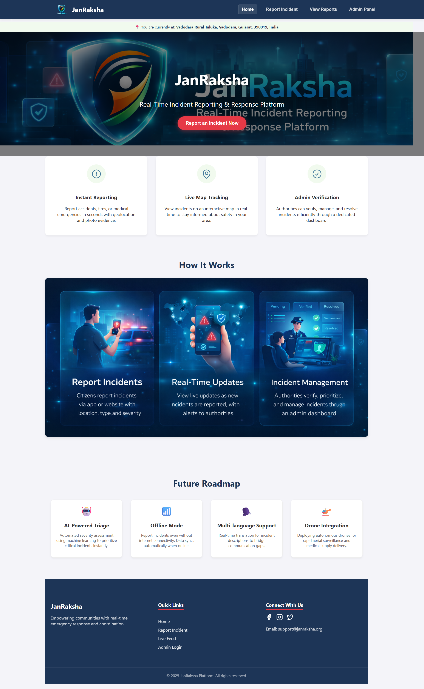
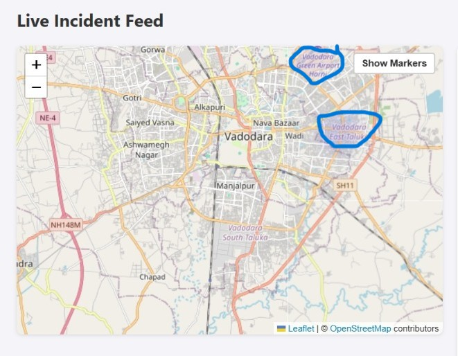

# JanRaksha - Real-Time Incident Reporting & Response Platform



**JanRaksha** (People's Protection) is a full-stack MERN application designed to bridge the gap between citizens and emergency authorities. It enables real-time incident reporting, resource coordination, and data-driven decision-making to save lives.

## 🚀 Key Features

### 📢 For Citizens
*   **Instant Reporting:** Report accidents, fires, medical emergencies, and more with a few clicks.
*   **Geolocation:** Automatic location detection with Reverse Geocoding (GPS to Address).
*   **Evidence Upload:** Attach photos to reports for better context.
*   **Live Feed:** View real-time incidents in your area on an interactive map.
*   **Distance Filter:** Filter incidents based on proximity (5km, 10km, etc.).
*   **Emergency Call:** Quick access to dial 112 directly from the mobile interface.

### 🛡️ For Authorities (Admin Panel)
*   **Real-Time Dashboard:** Live updates of incoming reports via WebSockets (Socket.io).
*   **Verification Workflow:** Verify, Resolve, or Delete incidents.
*   **Analytics:** Visual charts (Pie & Bar) for severity distribution and incident trends.
*   **Heatmap Visualization:** Identify high-risk zones using the toggleable Heatmap view.
*   **Duplicate Detection:** Auto-detection and merging of similar incidents reported in the same area/time.
*   **Internal Notes:** Add operational notes to incidents for internal coordination.

## 🛠️ Tech Stack

*   **Frontend:** React.js (Vite), Tailwind CSS (custom styles), Leaflet (Maps), Chart.js
*   **Backend:** Node.js, Express.js
*   **Database:** MongoDB (Atlas)
*   **Real-Time:** Socket.io
*   **Geospatial:** OpenStreetMap API (Nominatim), Leaflet.heat

## ⚙️ Installation & Setup

Follow these steps to run the project locally.

### Prerequisites
*   Node.js (v14+)
*   MongoDB Atlas Account (or local MongoDB)

### 1. Clone the Repository
```bash
git clone https://github.com/Satyaamp/janraksha.git
cd janraksha
```

### 2. Backend Setup
Navigate to the backend folder and install dependencies.

```bash
cd Backend
npm install
```

Create a `.env` file in the `Backend` directory:

```env
PORT=5000
MONGO_URI=your_mongodb_connection_string
JWT_SECRET=your_jwt_secret_key
NODE_ENV=development
```

Start the server:

```bash
npm run dev
```
*Server runs on http://localhost:5000*

### 3. Frontend Setup
Open a new terminal, navigate to the frontend folder, and install dependencies.

```bash
cd Frontend
npm install
```

Start the React app:

```bash
npm run dev
```
*App runs on http://localhost:5173*

## 📸 Screenshots

| Landing Page | Live Map |
|:---:|:---:|
|  |  |

## 🔮 Future Roadmap

*   **AI Triage:** Automated severity assessment using Machine Learning.
*   **Offline Mode:** PWA support for reporting without internet.
*   **Drone Integration:** Autonomous surveillance dispatch.
*   **Multi-language Support:** Real-time translation.

## 🤝 Contributing

Contributions are welcome! Please fork the repository and submit a pull request.

## 📄 License

This project is licensed under the MIT License.